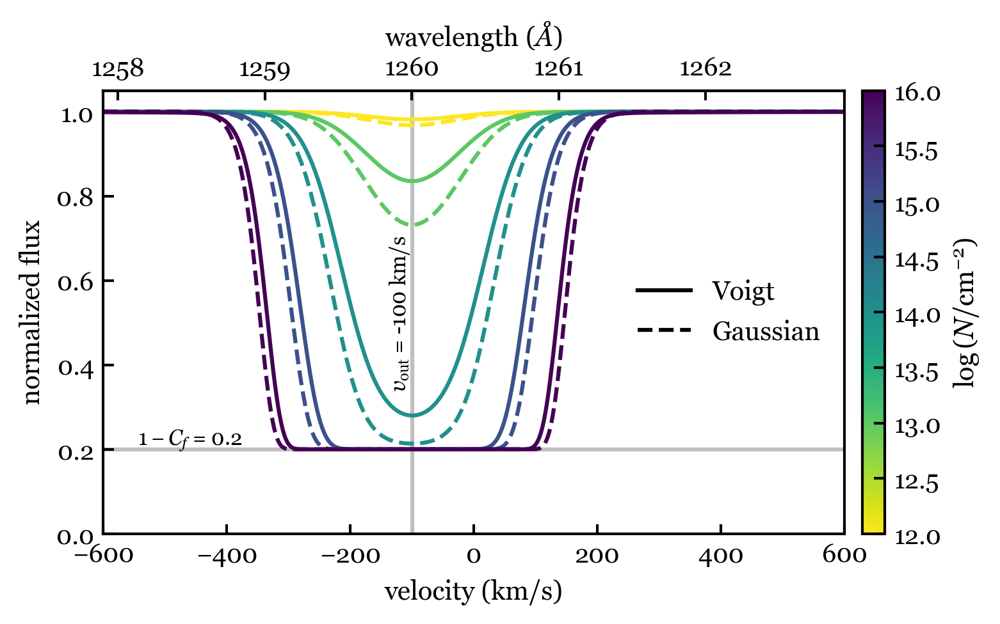

# The spectools Project
spectools is a Python package of helpful data and functions for working with astronomical spectroscopic data.
I developed spectools in order to efficiently process and analyze large amounts (270,000 lines) of mock simulated galaxy spectra
in the following paper:
    [A Simulated Galaxy Laboratory: Exploring the Observational Effects on UV Spectral Absorption Line Measurements (2025)](https://iopscience.iop.org/article/10.3847/1538-4357/ad9b13)

## Installation
To build spectools from source, clone the repository and install with pip.
```shell
git clone https://github.com/michaeljennings11/spectools.git
cd spectools
python -m pip install -e .
```

## Usage (ver 0.2.0)
Currently, only spectroscopic line data, line models and spectrum processing modules are implemented. 

### line_data
All spectroscopic line data is
stored in csv files by element taken from the [NIST](https://www.nist.gov/pml/atomic-spectra-database) website.
```python
from spectools import line_data as ld

# create instance of LineData class for the SiII 1260Angstrom line
SiII_1260 = ld.LineData("Si2_1260")

# get line data for transition
w = SiII_1260.wave # rest wavelength of line transition
A = SiII_1260.A # Einstein A coefficient of line transition
f = SiII_1260.f # oscillator strength of line transition

# printing the energy level diagram will gather required other line transitions
# and draw to console
SiII_1260.print_leveldiagram()
```


### line_model
```python
from spectools import line_model as lm

# create instance of LineModel class for the SiII 1260Angstrom line
vm = lm.VoigtModel("Si2_1260")
gm = lm.GaussianModel("Si2_1260")

# set absorption profile parameters
b = 100     # doppler parameter
log_n = 14  # log of ion column density
cf = 0.8    # covering fraction
vout = -100 # line-of-sight velocity

# get absoption profiles
w_vm, f_vm = vm.abs_profile(b,log_n,vout)
w_gm, f_gm = gm.abs_profile(b,log_n,vout)
```
Below are example Voigt and Gaussian absorption profiles.


### process
```python
from spectools import process

wave, flux = # spectrum data to load

# correct for redshift and convert to velocity space
z = 0.0003 # redshift
wave_rest = process.z_correct(wave,z=z)
velocity_rest = process.v_doppler(wave_rest,SiII_1260.wave)

# downgrade resolution (e.g. to match instrument resolution)
sig_res = 100 # gaussian std deviation in km/s for kernal smoother
flux_smooth = process.kernel_smooth(velocity_rest,flux,sig_res)
```

